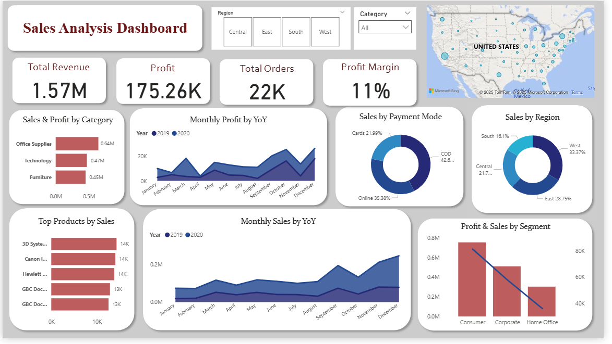

# 📊 Sales Dashboard

This is an interactive **Sales Dashboard** I created during my **Elevvo Internship**.  
The dashboard provides clear insights into sales performance, trends, and KPIs to support better business decision-making.

## 🔹 Features
-  Total Revenue & Total Units Sold
-  Monthly Sales Trend
-  Top Performing Products
-  Regional Sales Analysis
-  Interactive Filters for better insights

## 🔹 Tools Used
- Power BI (for visualization)
- Data Cleaning & Analysis Techniques

## 🔹 Screenshot

## 🔹 About Me
Hi 👋 I’m **Hadia Safdar**, a Data Analyst intern at **Elevvo**.  
I love working with **Excel, Power BI, SQL, and Python** to uncover insights from data.  

📫 Connect with me on [LinkedIn](https://www.linkedin.com/in/hadiasafdar/)  

✨ *If you like this project, don’t forget to give the repository a ⭐ on GitHub!*  
